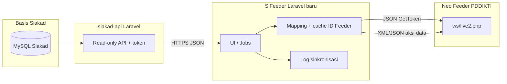

# Blueprint: SiFeeder (Laravel 12) + perluasan Siakad API

Dokumen ini merangkum **skema data**, **endpoint API Siakad** yang perlu ditambah/diperluas, **tabel aplikasi jembatan**, pemetaan **aksi Web Service Neo Feeder**, dan **keperluan non-fungsional** untuk membangun ulang SiFeeder di Laravel 12 (PHP 8.2) dengan konsumsi API dari proyek `siakad-api`.

Referensi perilaku bisnis: aplikasi lama `sifeeder2` (CodeIgniter), pemetaan Feeder ke `http://103.167.35.204:8100/ws/live2.php`.

---

## 1. Konteks sistem



**Prinsip:** SiFeeder tidak query langsung ke DB Siakad; semua bacaan lewat **siakad-api** (kecuali Anda sengaja menambahkan connection read-only di bridge—tidak disarankan duplikasi).

---

## 2. Konvensi semester (TahunID)

| Contoh | Arti |
|--------|------|
| `20241` | Tahun akademik 2024, semester ganjil (digit akhir 1 atau 3) |
| `20242` | Tahun akademik 2024, semester genap (digit akhir 2 atau 4) |

Digunakan konsisten sebagai `tahun_id` di query API dan sebagai `id_semester` / `id_periode_masuk` di payload Feeder (setelah validasi ke referensi Feeder).

---

## 3. Perluasan **siakad-api** (skema endpoint)

### 3.1 Endpoint yang sudah ada (pertahankan)

| Method | Path | Query | Keterangan |
|--------|------|-------|------------|
| GET | `/api/health` | — | Opsional di luar grup token |
| GET | `/api/semester-aktif` | — | Daftar `TahunID` unik dari tabel `tahun` (`DISTINCT TahunID`, tanpa filter NA) |
| GET | `/api/angkatan-mahasiswa` | — | Daftar angkatan (4 digit) dari `mhsw.TahunID` aktif |
| GET | `/api/prodi` | — | Master prodi (hanya `NA = 'N'`) |
| GET | `/api/kurikulum` | `prodi_id` | Kurikulum per prodi |
| GET | `/api/dosen` | — | Dosen aktif |
| GET | `/api/mahasiswa` | — | Ringkas; **tidak cukup** untuk biodata Feeder |
| GET | `/api/mata-kuliah` | — | MK |
| GET | `/api/kelas` | `tahun_id` | Jadwal/kelas |
| GET | `/api/krs` | `tahun_id` | KRS |
| GET | `/api/nilai` | `tahun_id` | Nilai final per KRS |

Middleware: `siakad.token` (sama seperti sekarang).

### 3.2 Endpoint baru yang disarankan

Semua di bawah grup `siakad.token`, prefix misalnya `/api/v1/…` atau tetap flat `/api/…` sesuai konvensi proyek Anda.

#### A. `GET /api/mahasiswa-sync` (biodata + filter layar SiFeeder)

**Tujuan:** Setara `M_Surat::getAll` untuk kirim biodata + riwayat.

**Query (semua opsional, kombinasi AND):**

| Parameter | Tipe | Contoh | Map ke SQL |
|-----------|------|--------|------------|
| `program_id` | string | `R` | `mhsw.ProgramID` |
| `prodi_id` | string | `ILMU KEPERAWATAN` | `mhsw.ProdiID` |
| `tahun_id` | string | `20251` | `mhsw.TahunID` (tepat) |
| `angkatan` | string | `2024` | `SUBSTRING(TRIM(mhsw.TahunID),1,4)` (empat digit) |
| `status_awal_id` | string | `B` | `mhsw.StatusAwalID` |

**Response `data[]` (minimal untuk Feeder `InsertBiodataMahasiswa` + konteks riwayat):**

- Identitas: `mhsw_id`, `nim` (prefer `Login` jika itu NIM di kampus Anda), `nama`
- Akademik: `program_id`, `prodi_id`, `tahun_id`, `status_awal_id`, `status_awal_nama`
- Biodata: `tempat_lahir`, `tanggal_lahir`, `jenis_kelamin` (`L`/`P` atau sumber join `kelamin.Nama` + normalisasi di API)
- `nama_ibu_kandung`, `agama_id_siakad`, `agama_nama`, `nik`, `nisn`, `email`, `alamat`, `kewarganegaraan_kode` (`ID`), wilayah/kelurahan jika ada kolom
- Flag non-aktif: `na` (abaikan baris `NA <> 'N'`)

**Catatan:** Normalisasi agama ke kode Feeder (`id_agama`) dilakukan di **SiFeeder** via tabel mapping, atau di API jika Anda ingin satu sumber kebenaran.

#### B. `GET /api/program` & `GET /api/status-awal`

**Tujuan:** Mengisi dropdown filter (setara `program` + `statusawal` di CI).

- `GET /api/program` → `{ id: ProgramID, nama }[]` (hanya baris `NA = 'N'`)
- `GET /api/status-awal` → `{ id: StatusAwalID, nama }[]`

#### C. `GET /api/khs` (aktivitas kuliah: IP semester, IPK, SKS)

**Tujuan:** Setara join `mhsw` + `khs` untuk `InsertPerkuliahanMahasiswa`.

**Kanonik kolom tabel `khs` (Siakad):**

| Kolom `khs` | Arti | Isi field JSON API (disarankan) | Field payload Neo Feeder (`InsertPerkuliahanMahasiswa`) |
|-------------|------|----------------------------------|--------------------------------------------------------|
| `IPS` | **IP semester** (indeks semester berjalan) | `ip_semester` | `ips` |
| `IP` | **IP kumulatif (IPK)** sampai semester tersebut | `ipk` | `ipk` |
| `SKS` | SKS semester | `sks_semester` | `sks_semester` |
| `TotalSKS` | Total SKS kumulatif | `total_sks` | `total_sks` |

Ini selaras dengan aplikasi lama `Perkuliahan.php` (`ips` ← `$mhsw->IPS`, `ipk` ← `$mhsw->IP`).

**Query:**

| Parameter | Wajib | Keterangan |
|-----------|--------|------------|
| `tahun_id` | Ya | Semester KHS (`khs.TahunID`) |
| `program_id` | Tidak | Filter |
| `prodi_id` | Tidak | Filter |

**Response `data[]`:**

- `mhsw_id`, `nim`, `nama`, `prodi_id`, `program_id`
- `tahun_id` (sama query)
- `ip_semester` (nilai dari **`khs.IPS`**), `ipk` (nilai dari **`khs.IP`**)
- `sks_semester` (`khs.SKS`), `total_sks` (`khs.TotalSKS`), `biaya` (`khs.Biaya`, jika dipakai)
- Pastikan join: satu baris per `(mhsw_id, tahun_id)`; jika legacy join memakai `mhsw.TahunID`, pertimbangkan parameter opsional `join_mode=mhsw_tahun|khs_only` untuk kompatibilitas.

#### D. `GET /api/kelas-peserta` (nilai per peserta kelas)

**Tujuan:** Mendukung `UpdateNilaiPerkuliahanKelas` tanpa query langsung dari bridge.

**Query:**

| Parameter | Wajib |
|-----------|--------|
| `jadwal_id` | Ya |
| `tahun_id` | Disarankan |
| `prodi_id` | Opsional |
| `mk_kode` | Opsional |
| `nama_kelas` | Opsional |

**Response:** daftar peserta dengan `mhsw_id`, `nilai_angka`, `nilai_huruf`, `bobot`, relasi ke `jadwal_id`, `mk_kode`, `nama_kelas`.

#### E. `GET /api/nilai-konversi`

**Tujuan:** Mahasiswa pindahan / RPL — baris KRS dengan join `mhsw`, `statusawal`, `mk`, `jadwal` (setara kebutuhan layar konversi + lookup kelas di Neo Feeder).

**Query:** `program_id`, `prodi_id`, **`angkatan`** (4 digit, dari `mhsw.TahunID` masuk), **`tahun_krs`** (opsional — filter semester baris `krs.TahunID`), `mhsw_id`, `nim` (NIM tepat), `status_awal_id` (kosong = default `StatusAwalID IN ('P','J')`).

**Response (per baris):** `krs_id`, `mhsw_id`, `nim`, `nama_mahasiswa`, **`angkatan`**, `program_id`, `prodi_id`, `status_awal_id`, `status_awal_nama`, `tahun_id` (semester KRS), `jadwal_id`, `mk_id`, `mk_kode`, `nama_mk`, `sks_mk`, `nama_kelas`, `tahun_jadwal`, `status_krs`, `final`, `nilai_angka`, `nilai_huruf`, `bobot`.

**Catatan Feeder:** Aplikasi lama memakai filter seperti `id_semester` + `kode_mata_kuliah` + `nama_kelas_kuliah` pada `GetDetailNilaiPerkuliahanKelas` untuk mendapatkan `id_kelas_kuliah`, lalu update nilai.

#### F. `GET /api/mahasiswa-keluar` (lulus / DO)

**Tujuan:** Setara `M_Daftar_Mahasiswa_Lulus` + `InsertMahasiswaLulusDO`.

**Query:** `program_id`, `prodi_id`, `tahun_id` (tepat `mhsw.TahunID`), **`angkatan`** (4 digit), `status_lulus_id` (map ke `ta.StatusLulusID`).

**Response:** `mhsw_id`, `nim`, `nama`, `tanggal_keluar`, `ipk`, `nomor_ijazah`, `status_lulus_id`, `status_lulus_nama`, dll.

#### G. `GET /api/status-lulus`

Master untuk filter: dari tabel `statuslulus`.

---

### 3.3 Ringkasan file implementasi di `siakad-api`

| File | Perubahan |
|------|-----------|
| `routes/api.php` | Daftarkan route baru di grup `siakad.token` |
| `app/Http/Controllers/Api/SiakadSyncController.php` | Method baru atau controller terpisah `MahasiswaSyncController` |
| `app/Services/SiakadReadService.php` | Method query: `mahasiswaSync()`, `angkatanMahasiswa()`, `programs()`, `statusAwal()`, `khs()`, `kelasPeserta()`, `nilaiKonversi()`, `mahasiswaKeluar()`, `statusLulus()` |
| (opsional) `app/Http/Requests/...` | Validasi query string |

---

## 4. Aplikasi **SiFeeder** (Laravel 12): modul & layanan

### 4.1 Bounded context / modul

| Modul | Sumber API | Aksi Feeder utama (dari analisis CI) |
|-------|------------|----------------------------------------|
| Auth PT | — | `GetToken` |
| Mahasiswa | `/api/mahasiswa-sync` | `InsertBiodataMahasiswa`, `InsertRiwayatPendidikanMahasiswa`, `UpdateRiwayatPendidikanMahasiswa`, lookup `GetListMahasiswa`, `GetBiodataMahasiswa`, `GetListRiwayatPendidikanMahasiswa` |
| Aktivitas kuliah | `/api/khs` | `InsertPerkuliahanMahasiswa` (dan update jika WS menyediakan) |
| Nilai kelas | `/api/kelas-peserta` + `/api/kelas` | `GetDetailNilaiPerkuliahanKelas`, `UpdateNilaiPerkuliahanKelas` |
| Nilai konversi | `/api/nilai-konversi` atau `/api/krs` | `GetListKelasKuliah`, dll. (sesuaikan dengan dokumentasi Feeder terbaru) |
| Dosen | `/api/dosen` | `Insert/Update` dosen sesuai WS |
| MK / Kurikulum | `/api/mata-kuliah`, `/api/kurikulum` | Sinkron master ke Feeder bila diperlukan |
| Keluar (lulus/DO) | `/api/mahasiswa-keluar` | `InsertMahasiswaLulusDO`, lookup `GetListRiwayatPendidikanMahasiswa` |

### 4.2 Struktur folder (disarankan)

```
app/
  Http/Controllers/Admin/...
  Services/
    Siakad/
      SiakadApiClient.php       # HTTP + auth header ke siakad-api
    Feeder/
      FeederClient.php          # GetToken + post XML/JSON
      FeederXmlEncoder.php
    Sync/
      MahasiswaSyncService.php
      PerkuliahanSyncService.php
      NilaiSyncService.php
      KeluarSyncService.php
      DosenSyncService.php
  Jobs/
    SyncMahasiswaBatchJob.php
    ...
  Models/
    FeederProdiMap.php
    FeederSyncLog.php
    ...
database/migrations/
config/
  feeder.php      # URL WS, timeout
  siakad.php      # base URL API, token
```

---

## 5. Skema database **lokal SiFeeder** (bukan Siakad)

Tabel ini menyimpan mapping, antrian, dan audit. Sesuaikan nama dengan konvensi Laravel Anda.

### 5.1 `feeder_prodi_maps`

| Kolom | Tipe | Keterangan |
|-------|------|------------|
| `id` | bigint PK | |
| `siakad_prodi_id` | string | `mhsw.ProdiID` |
| `feeder_id_prodi` | uuid string | ID prodi di Feeder |
| `feeder_id_prodi_asal` | uuid nullable | Untuk pindahan |
| `feeder_id_pt_asal` | uuid nullable | |
| `is_active` | boolean | |
| `timestamps` | | |

### 5.2 `feeder_jenis_daftar_maps`

Map `StatusAwalID` (Siakad) → `id_jenis_daftar` (Feeder): misal B→1, P→2, J→16.

### 5.3 `feeder_agama_maps`

Map nama/kode agama Siakad → `id_agama` Feeder.

### 5.4 `feeder_sync_logs`

| Kolom | Tipe |
|-------|------|
| `id` | bigint PK |
| `sync_type` | string (`mahasiswa_biodata`, `perkuliahan`, `nilai_kelas`, …) |
| `payload_summary` | json | NIM, tahun_id, tanpa data sensitif penuh |
| `feeder_error_code` | int nullable |
| `feeder_error_desc` | text nullable |
| `success` | boolean |
| `user_id` | bigint nullable |
| `timestamps` | |

### 5.5 `feeder_id_cache` (opsional, mengurangi panggilan GetList)

| Kolom | Tipe |
|-------|------|
| `entity_type` | string (`registrasi_mahasiswa`, `kelas_kuliah`, …) |
| `local_key` | string | misal `nim`, atau `tahun_id|mk_kode|nama_kelas` |
| `feeder_uuid` | string |
| `expires_at` | timestamp |

---

## 6. Konfigurasi lingkungan

### SiFeeder `.env` (contoh)

```
SIAKAD_API_BASE_URL=https://domain-anda/siakad-api/public/api
SIAKAD_API_TOKEN=...

FEEDER_WS_URL=http://103.167.35.204:8100/ws/live2.php
FEEDER_USERNAME=...
FEEDER_PASSWORD=...

FEEDER_ID_PERGURUAN_TINGGI=...
FEEDER_DEFAULT_ID_WILAYAH=070000
```

**Jangan** menyimpan kredensial di Git. Rotasi password yang pernah tertulis di repo lama.

### siakad-api

Tetap gunakan `config/siakad_api.php` + env untuk `kode_id`, koneksi `siakad`, dan token outbound.

---

## 7. Non-fungsional

| Area | Rekomendasi |
|------|-------------|
| **Performa** | Job queue (`database` atau `redis`), chunk NIM, jeda antar-request ke Feeder |
| **Timeout** | HTTP client 60–120s untuk batch kecil; untuk besar gunakan job per item |
| **Idempotensi** | Sebelum insert, cek `GetListMahasiswa` / riwayat; log hasil |
| **Format WS** | `GetToken` JSON; body data sering XML—satu `FeederClient` yang mendukung keduanya |
| **Keamanan** | RBAC untuk siapa boleh kirim; rate limit API internal; enkripsi backup log |
| **Monitoring** | Dashboard jumlah sukses/gagal per `sync_type` + hari |

---

## 8. Tahapan implementasi

1. **Perluas siakad-api** — endpoint seksi 3.2 (utamakan `mahasiswa-sync`, `khs`, `mahasiswa-keluar`, master program/status).
2. **Bootstrap Laravel 12** SiFeeder — config, `SiakadApiClient`, `FeederClient`, migrasi mapping + log.
3. **Port mapping** dari switch-case CI ke **seed** `feeder_prodi_maps` + UI admin kecil untuk edit UUID.
4. **Modul mahasiswa** — replikasi alur `kirim` / update / tambah riwayat dengan tes sandbox Feeder.
5. **Modul perkuliahan & nilai** — termasuk perhitungan `nilai_indeks` (pindahkan ke policy/config agar mudah disesuaikan).
6. **Modul keluar** — lulus/DO.
7. **Dosen & master** — jika masuk cakupan proyek.
8. **Hardening** — queue, retry, hapus duplikasi lookup dengan cache.

---

## 9. Referensi silang ke kode lama

| File CI | Fungsi |
|---------|--------|
| `application/controllers/Sifeeder.php` | Token, biodata, riwayat, update |
| `application/controllers/Perkuliahan.php` | `InsertPerkuliahanMahasiswa` |
| `application/controllers/Nilai_Perkuliahan.php` | `UpdateNilaiPerkuliahanKelas` |
| `application/controllers/Nilai_Konversi.php` | Konversi + `GetListKelasKuliah` |
| `application/controllers/Daftar_Mahasiswa_Lulus.php` | `InsertMahasiswaLulusDO` |
| `application/models/M_Surat.php` | Filter mahasiswa |
| `application/models/M_Perkuliahan.php` | Join KHS |
| `application/models/M_Daftar_Mahasiswa_Lulus.php` | Lulus/DO + TA |

---

*Dokumen ini dapat disalin ke repositori SiFeeder Laravel saat proyek dibuat; lokasi saat ini: `siakad-api/docs/` agar tim API dan tim bridge sinkron.*
